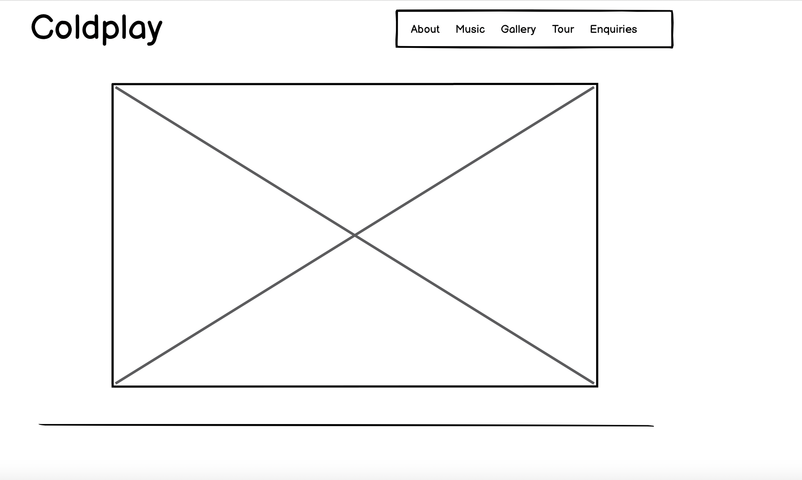
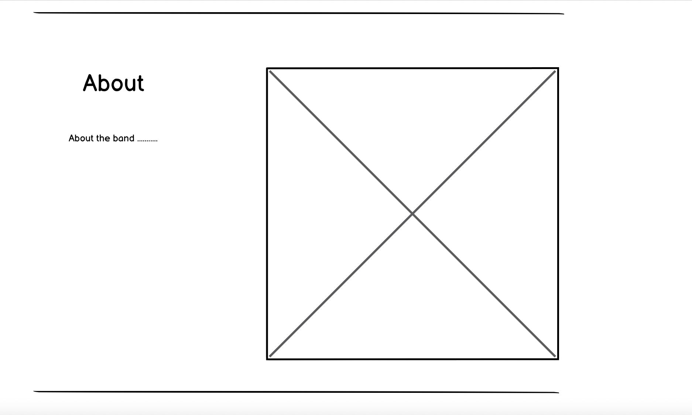
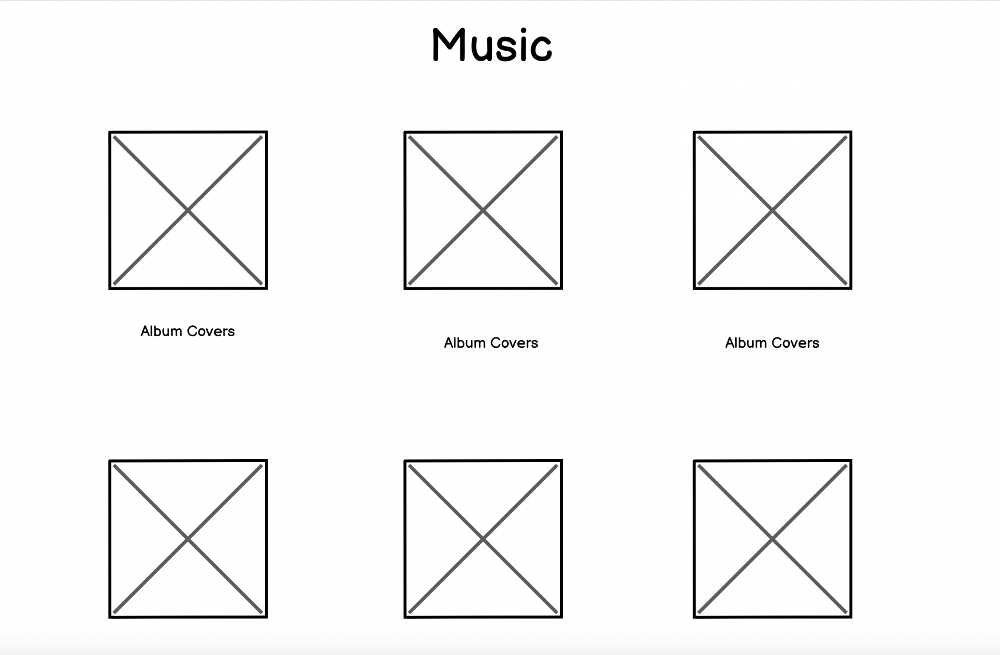
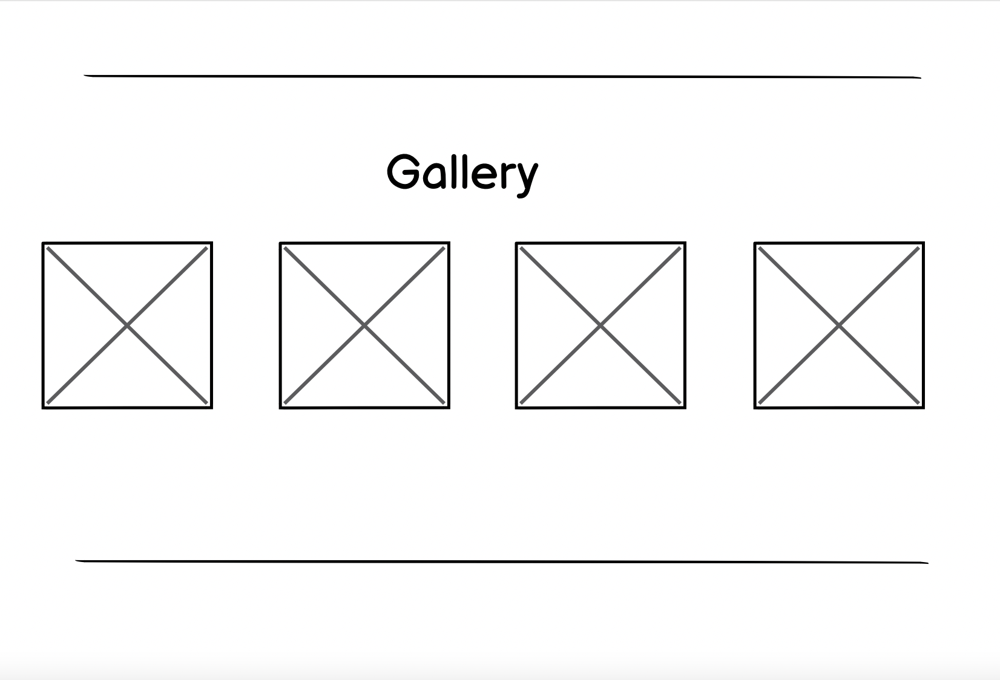
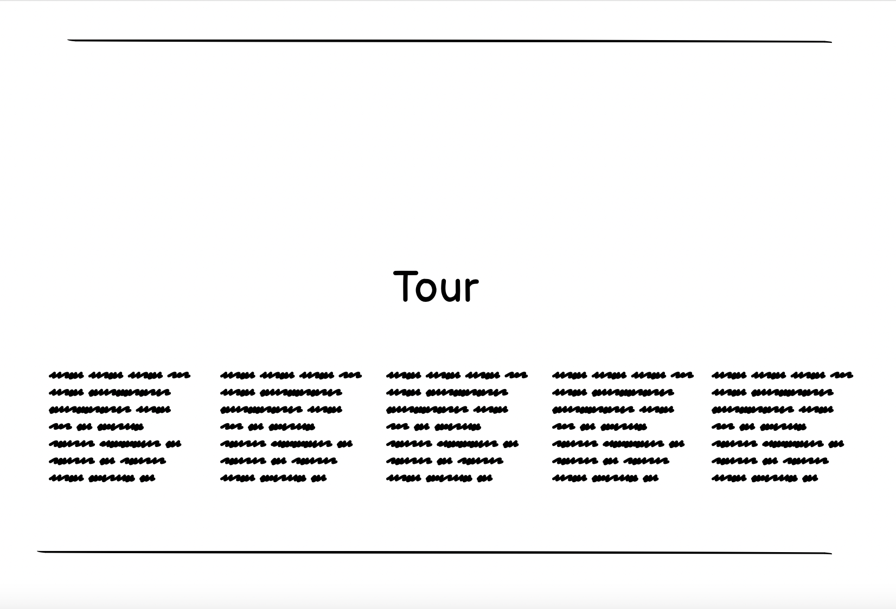
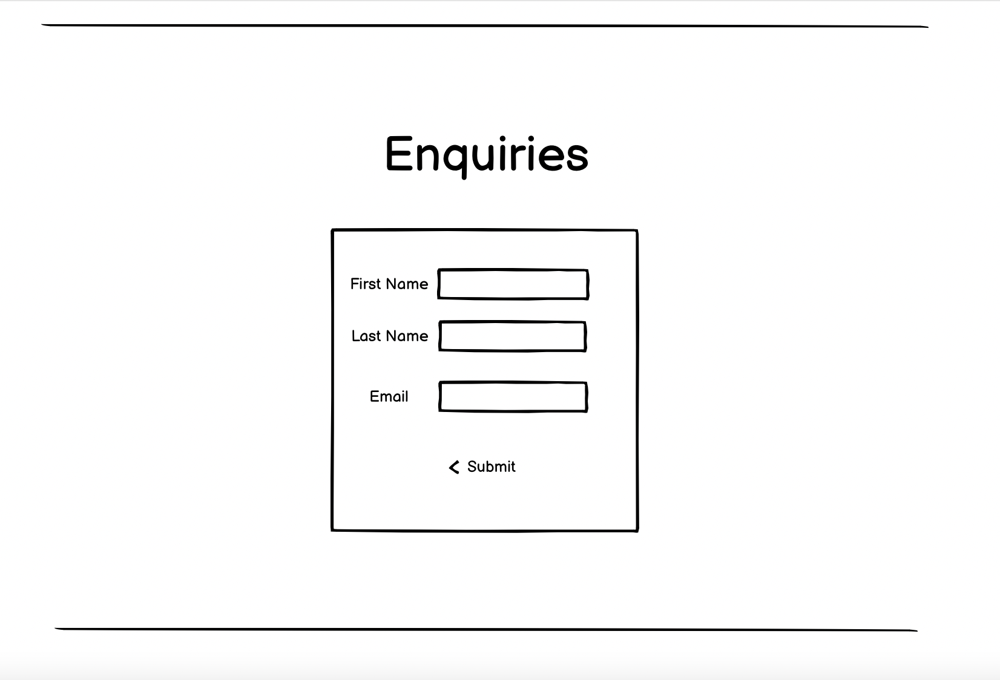
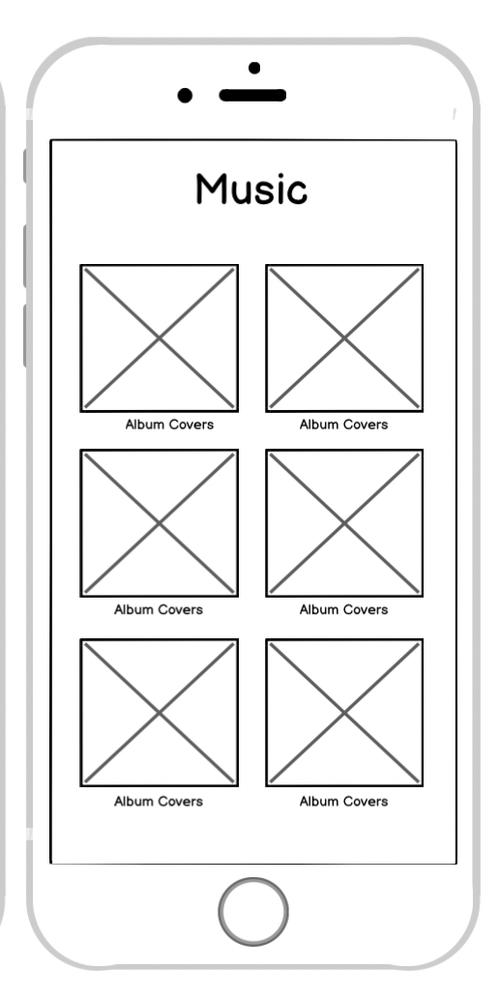
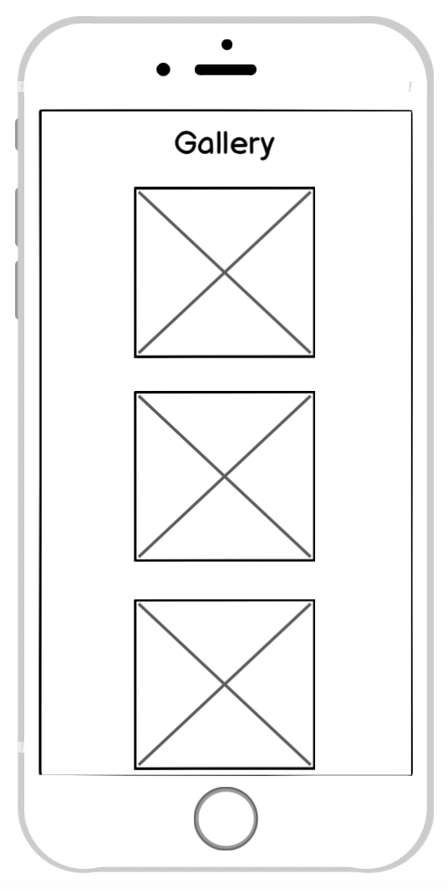
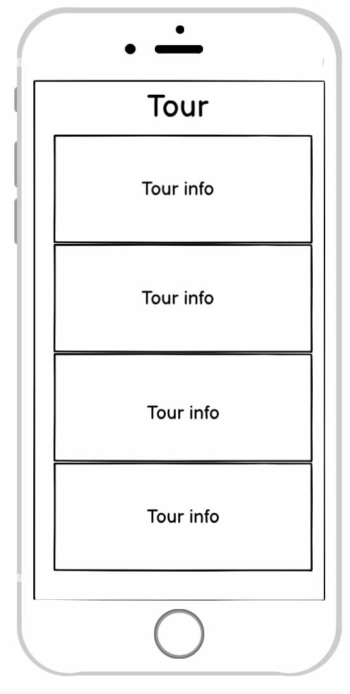
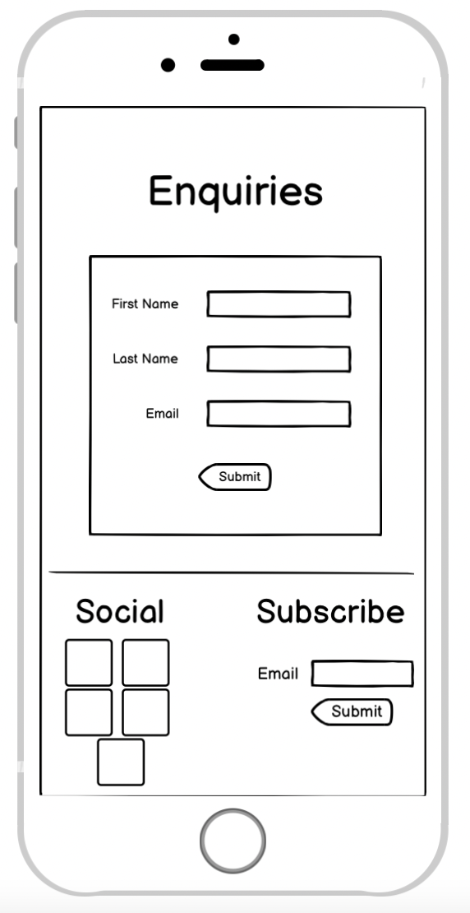

# Coldplays Official Site

This website was designed for the fans of the Rock Music band Coldplay.
The websit allows the user to learn about the band, see their latest albums and find where to listen to them. It allows them to see pictures
of the band preforming live. See when and where the band is going on tour. It allows them to request a booking with the band and subscribe
to the newsletter. And it provides links to the bands social media accounts to stay up to date at all times.

You can view the deployed website here - https://hannah1lowe.github.io/Coldplay-Official-Site/

## UX

Before I did some research I sat and thought about what I look for in a website about an artist.
I then did some research looking at other artists websites like, 
**Lana Del Rey - https://www.lanadelrey.com/homepage/**
**Ariana Grande - https://www.arianagrande.com/**
**Coldplay - https://www.coldplay.com/**
to see if the layout I had pictured would be suitable for a fan base.
I wanted to make sure there was a website to satisfy the users needs.

## User Stories

* As a fan of the band Coldplay I want to be able to see what albums the band has released and to find where to listen to them.
* As a fan of the band Coldplay I want to be able to know when the band is on tour and what city they are in.
* As a fan of the band Coldplay I want to be able to see pictures of them performing live.
* As a fan of the band Coldplay I want to be able to subscribe to a newsletter to stay up to date with the band.
* As a fan of the band Coldplay I want to be able to request to see if I could book Coldplay for an event
* As a fan of the band Coldplay I want to be able learn some information about the band.

## Wireframes

### *Homepage*

  
  

### *About* 

  

### *Music*

  

### *Gallery*

  

### *Tour*

  

### *Enquiries*

  

### *Mobile View*

  
  
  
  
  

## *Features*

 * Navigation Bar - This allows users to easily navigate the site, it is easy to use and is consistent throughout the website.
 * Music Albums - Clicking on an album cover will take the user to Spotify so the user can listen to their.
 * Gallery Images - Clicking on the images will open a modal which will allow the image to show at its full size.
 * Enquiries Form - A form to fill out to request to get in contact with the band to organise an event.
 * Subscribe Email - A text box to fill in the users email to subscribe to teh bands newsletter.
 * Social Links - The footer has the bands social media links for Facebook, Twitter, Instagram, Youtube and Spotify.

 ## *Features left to implement*

 * Meet the band - individual profile on each band member.
 * Add videos to be able to play on the site without having to leave.

 ## *Technologies Used*

 * HTML - provides the content and structure.

 * CSS - provides the styling.

 * Bootstrap - I used bootstrap for things like rows, containers, modals etc.

 * Google Fonts - I used the Cinzel font.

 * Font Awesome - I used font awesome for icons.

## *Testing*

I validated the HTML with the W3 Validation Service. There was a warning about lack of a heading inside the first section on the home page. 
This section contains only an image so I did not feel the need to include a heading here, so I decided I could leave this as is because it was just a warning about HTML semantics.

### Testing on Browsers, Screen sizes and Devices

I tested the website on the following browsers and devices:

* Chrome on PC and Mac
* Safari on Mac
* Chrome and Safari on IOS 

I tested the website on other devices using [Browser Stack](https://www.browserstack.com/) to test on real devices and screen sizes. 
I was able to live test the following devices:
* Iphone 12 Chrome and Safari Resolution 1170x2532 px Viewport 393 x 786 dp
* Iphone 6 Chrome and Safari Resolution 750 x 1334 px Viewport 375 x 667 dp

### User Story Tests

1. About page 
i. Click on the about link in the nav bar. 
ii. Does it take you to about? 

**All tests performed and no errors found.**

2. Music 
i. Click on the music link in the nav bar. 
ii. Does it take you to the music section? 
iii. Hover over the album images. 
iv. Does it fade when the cursor is over it? 
v. Click on an album. 
vi. Does it take you to that albums Spotify page? 

**All tests performed and no errors found.**

3. Gallery  
i. Click on the gallery link in the nav bar. 
ii. Does it take you to the gallery section? 
iii. Click on an image. 
iv. Does it open the image in full size? 

**All tests performed and it was found on devices smaller than 700px the image is not fully visible**

4. Tour  
i. Click on the tour link in the nav bar. 
ii. Does it take you to the tour section? 
iii. Is the tour information visible? 

**All tests performed and no errors found.**

5. Enquiries 
i. Click on the enquiries link in the nav bar. 
ii. Does it take you to the enquiries section? 
iii. Does it allow you to enter your name and email? 
iv. Does the submit buttom work? 
v. Does the modal pop up? 

**All tests performed and no errors found.**

6. Subscribe 
i. Go to the footer to the subscribe section. 
ii. Does it allow you to enter your email? 
iv. Does the submit buttom work? 
v. Does the modal pop up? 

**All tests performed and no errors found.**

7. Social links 
ii. Hover over the social icons. 
iii. Do the icons change colour? 
iv. Click on an icon. 
v. Does it take you to the associated social media site? 

**All tests performed and no errors found.**

I also used Google Chrome Tools to test the website on all of the devices provided there. All tests passed on the devices. 

## Deployment 

My website is deployed on GitHub. I used GitPod to create the website and pushed it to GitHub

In order to get to github please follow these steps.

1. Navigate to my Github repository - https://github.com/hannah1lowe/Coldplay-Official-Site
1. Click on the settings tab at the top of the page.
1. Scroll down to the GitHub Pages section.
1. Change the source to master branch.
1. After selecting master branch the page will refresh.
1. Scroll down to the GitHub Pages section and a green box saying "Your site is published at https://hannah1lowe.github.io/Coldplay-Official-Site/"
1. Click the link to go to the published website.

## Credits

### Code

* The text I used for the drop down button on mobile device is copied from [getbootstrap](https://getbootstrap.com/docs/5.0/getting-started/introduction/)
* The text I used for the gallery modal image is copied from [getbootstrap](https://getbootstrap.com/docs/5.0/getting-started/introduction/)
* The form in the Enquiries section and the modal when the form is submitted is copied from [getbootstrap](https://getbootstrap.com/docs/5.0/getting-started/introduction/)
* The social links in the footer is copied from [getbootstrap](https://getbootstrap.com/docs/5.0/getting-started/introduction/)
* The email text-box from the Subscribe to the newsletter is copied from [getbootstrap](https://getbootstrap.com/docs/5.0/getting-started/introduction/)

### Images

* The background image for the about section [Google Images](https://www.google.com/search?hl=en-IE&tbs=simg:CAQSgwIJ90oXtkR6N_1wa9wELELCMpwgaOgo4CAQSFO0k-x_1rJYIB9TW_1Ffo2pgjbOa8_1GhpNE2waB52UeqD4f0l-_12xc2sIqi85_1Yno1viAFMAQMCxCOrv4IGgoKCAgBEgQHQt4mDAsQne3BCRqXAQofCgxyb2NrIGNvbmNlcnTapYj2AwsKCS9tLzA2bWdfagodCgpiYW5kIHBsYXlz2qWI9gMLCgkvai82em0wenoKFwoDZnVu2qWI9gMMCgovbS8wZHM5OWxoCiIKEG11c2ljYWwgZW5zZW1ibGXapYj2AwoKCC9tLzA1MjI5ChgKBXN0YWdl2qWI9gMLCgkvbS8wNF81aHkM&sxsrf=ALeKk01YoNbRyAvk4ARONfO5l-STMxOTog:1616528952774&q=coldplay+backstage&tbm=isch&sa=X&ved=2ahUKEwif7v7Pl8fvAhUCu3EKHUKhD9MQwg4oAHoECAEQMQ&biw=1440&bih=703#imgrc=LXIzuIkg6b5_VM)
* The album cover for A Head Full of Dreams [Google Images](https://www.google.com/search?sa=G&hl=en_GB&tbs=simg:CAQS9QEJ0SLcjp8uEY4a6QELELCMpwgaOgo4CAQSFMw6pB-ZA5At2CzXDL8V1D7bGZchGhpyCq2x9w5expsc2RvnvpURTgA80HQIXAQJHCAFMAQMCxCOrv4IGgoKCAgBEgQ67FfRDAsQne3BCRqJAQoZCgZ0cmlwcHnapYj2AwsKCS9hL2QyMDQycgoWCgNkb3TapYj2AwsKCS9tLzAyN2N0ZwoUCgNhcnTapYj2AwkKBy9tLzBqancKHQoLZnJhY3RhbCBhcnTapYj2AwoKCC9tLzBjeHd0Ch8KDGFic3RyYWN0IGFydNqliPYDCwoJL20vMDE5N3M2DA&sxsrf=ALeKk02S1uEfADBVPCeg3PLZE8LTOl3WvQ:1616529146506&q=cold+play+hymn+for+the+weekend&tbm=isch&ved=2ahUKEwj2kK-smMfvAhUxpHEKHYpDBHsQwg4oAHoECAEQMQ&biw=1440&bih=703#imgrc=Ck-GW55Wgt-RnM)
* The album cover for Ghost Stories [Google Images](https://www.google.com/search?sa=G&hl=en_GB&tbs=simg:CAQSuAEJkhOEOyUqd0QarAELELCMpwgaOgo4CAQSFLkVoznlJKsetDrDJZkDthPBHoQeGhpp-CVKQFsBD0cPyKQzxjVWJzWcQWp1GeDPoSAFMAQMCxCOrv4IGgoKCAgBEgTmX_1zxDAsQne3BCRpNChQKA2FydNqliPYDCQoHL20vMGpqdwoYCgVuaWdodNqliPYDCwoJL20vMDFkNzR6ChsKCGRhcmtuZXNz2qWI9gMLCgkvbS8wMWt5cjgM&sxsrf=ALeKk02YWpWC1JpHqbxI2Z0j0_Y8WI5d4Q:1616529313765&q=ghost+stories+coldplay+album+cover&tbm=isch&ved=2ahUKEwi514_8mMfvAhUwVBUIHdbwCqEQwg4oAHoECAEQMQ&biw=1440&bih=703#imgrc=lqgdMlygtFliYM)
* The album cover for X&Y Album [Google Images](https://www.google.com/search?sa=G&hl=en_GB&tbs=simg:CAQSxAEJr9uDlPWGHrsauAELELCMpwgaOgo4CAQSFNcSqx6DB48Mozn4J9sZiR_1VFbYTGhpWGKIIdBMPsXWnNRckCEp5DkzdZfN1TNAjBiAFMAQMCxCOrv4IGgoKCAgBEgRnm3h2DAsQne3BCRpZChsKCHZlcnRpY2Fs2qWI9gMLCgkvYS80aGgzcDAKHQoKaG9yaXpvbnRhbNqliPYDCwoJL2EvMm1xdnpjChsKCGxhbmd1YWdl2qWI9gMLCgkvai8yc2hfeTQM&sxsrf=ALeKk02UyaJ1UN2F45zWWD5CNlCvFoeEuA:1616529483410&q=coldplay+x+and+y+album+cover&tbm=isch&ved=2ahUKEwimm4LNmcfvAhXrZxUIHU3lBaIQwg4oAHoECAEQMQ&biw=1440&bih=703#imgrc=aDi-VsKkd6JiaM)
* The album cover for Parachutes [Google Images](https://www.google.com/search?sa=G&hl=en_GB&tbs=simg:CAQS7QEJKnuwt8o0J8Aa4QELELCMpwgaOgo4CAQSFKQMvxjwMfsghy-1PdwV7jT6GpkDGhqJJTqkZ-DAzrYRoHrPi1ELwc2QpsElyT02fiAFMAQMCxCOrv4IGgoKCAgBEgR992czDAsQne3BCRqBAQoYCgZzcGhlcmXapYj2AwoKCC9tLzA2eTQ3ChgKBW5pZ2h02qWI9gMLCgkvbS8wMWQ3NHoKGAoGY2lyY2xl2qWI9gMKCggvbS8wMXZrbAoUCgNhcnTapYj2AwkKBy9tLzBqancKGwoIZGFya25lc3PapYj2AwsKCS9tLzAxa3lyOAw&sxsrf=ALeKk00XldY121oUTPfo6lJmX0mVZYnfLA:1616529535748&q=coldplay+parachutes&tbm=isch&ved=2ahUKEwjux_zlmcfvAhWZShUIHadcAGcQwg4oAHoECAIQMQ&biw=1440&bih=703#imgrc=ptkkBPJwLNNdfM)
* The album cover for Rush of Blood to the Head [Google Images](https://www.google.com/search?sa=G&hl=en_GB&tbs=simg:CAQS_1QEJK6evk2e9UG8a8QELELCMpwgaOgo4CAQSFLQ63yXkD-QZ3DyPPPgy9CnEE_1YgGhqreXAY6RESxUrxNdNLIZhAh6Oc35Bxg7Sw9iAFMAQMCxCOrv4IGgoKCAgBEgTqtnXxDAsQne3BCRqRAQogCgxhcnQgY2hhcmNvYWzapYj2AwwKCi9tLzBoOGxodnEKGQoGc2tldGNo2qWI9gMLCgkvbS8wN2dsenEKFAoDYXJ02qWI9gMJCgcvbS8wamp3Ch8KDGlsbHVzdHJhdGlvbtqliPYDCwoJL20vMDFrcjhmChsKCGxpbmUgYXJ02qWI9gMLCgkvbS8wOTE5cngM&sxsrf=ALeKk02wJ2PZlGpjRchfI5LfufeyQ3Wb8w:1616529612387&q=coldplay+a+rush+of+blood+to+the+head+2002&tbm=isch&ved=2ahUKEwjHncKKmsfvAhUkTBUIHYXTDm0Qwg4oAHoECAEQMQ&biw=1440&bih=703#imgrc=L8Hm7rq-a-EZcM)
* The album cover for Viva La Vida [Google Images](https://www.google.com/search?sa=G&hl=en_GB&tbs=simg:CAQSgQIJiFHRadehZ2sa9QELELCMpwgaOwo5CAQSFJAt3yXOJ8w5pAXBHKMDsx-lMfYbGhuDM3qfn2gwd7KQ_1VDo-ikKnUkKL7kvQ8H03GAgBTAEDAsQjq7-CBoKCggIARIEJwiM2wwLEJ3twQkalAEKIAoNcGljdHVyZSBmcmFtZdqliPYDCwoJL20vMDZ6MzdfCh0KCWFydCBwYWludNqliPYDDAoKL20vMGg5MHc1ZAoYCgVldmVudNqliPYDCwoJL20vMDgxcGtqChsKCWZpbmUgYXJ0c9qliPYDCgoIL20vMG1nMXcKGgoIcGFpbnRpbmfapYj2AwoKCC9tLzA1cWRoDA&sxsrf=ALeKk02UqyRN8Q-bELNYcgMxwFa_mJkQuQ:1616529677031&q=coldplay+viva+la+vida+poster&tbm=isch&ved=2ahUKEwj0_6upmsfvAhXNRBUIHW9PAxcQwg4oAHoECAEQMQ&biw=1440&bih=703#imgrc=iFHRadehZ2vo8M)
* An image in the gallery section [Google Images](https://www.google.com/search?sa=G&hl=en_GB&tbs=simg:CAQS9gEJMNvSEZ-6vPwa6gELELCMpwgaOgo4CAQSFNwVwDWsLesl-x-_1Ffo2sgK5J9IkGhoxJdNrLTk08u-RZFgE3e2SJetU_1Uy58tYM4SAFMAQMCxCOrv4IGgoKCAgBEgT_1q6IJDAsQne3BCRqKAQoYCgVmw6p0ZdqliPYDCwoJL20vMDdiYjJfChsKCGNvbmZldHRp2qWI9gMLCgkvbS8wMzZuNWgKFwoDZnVu2qWI9gMMCgovbS8wZHM5OWxoCh4KC2NlbGVicmF0aW5n2qWI9gMLCgkvai82Y2txdHAKGAoFbmlnaHTapYj2AwsKCS9tLzAxZDc0egw&sxsrf=ALeKk00-PTrHnSKPC6hXdpAx8zPofTnLqQ:1616529737621&q=lovers+in+japan+live&tbm=isch&ved=2ahUKEwia953GmsfvAhWYaRUIHbjwDacQwg4oAHoECAEQMQ&biw=1440&bih=703#imgrc=7kPMbkCXIO1DVM)
* An image in the gallery section [Google Images](https://www.google.com/search?sa=G&hl=en_GB&tbs=simg:CAQS-wEJwSywk1pwcBka7wELELCMpwgaOgo4CAQSFL8V-jbrJfsfwDWmCMw64iOsLaEsGhqkl2El0OCm59mvbXBb_1g21ehYSE4nWmUcJyyAFMAQMCxCOrv4IGgoKCAgBEgTvSFdQDAsQne3BCRqPAQofCgxyb2NrIGNvbmNlcnTapYj2AwsKCS9tLzA2bWdfagobCghjaGVlcmluZ9qliPYDCwoJL20vMDUzaHoxCh4KC2NlbGVicmF0aW5n2qWI9gMLCgkvai82Y2txdHAKFwoDZnVu2qWI9gMMCgovbS8wZHM5OWxoChYKBHJhdmXapYj2AwoKCC9tLzBieGRmDA&sxsrf=ALeKk033FUJoL1CJmJ6SIO5BBCaDGObpbw:1616529786851&q=coldplay+concert+abu+dhabi&tbm=isch&ved=2ahUKEwjB8trdmsfvAhVBtHEKHbwCDAIQwg4oAHoECAEQMQ&biw=1440&bih=703#imgrc=wSywk1pwcBla1M)
* An image in the gallery section [Google Images](https://www.google.com/search?q=coldplay&rlz=1C5CHFA_enIE929IE929&sxsrf=ALeKk010pDSQO3KIpfj9KUCWyMRB0LbSXw:1616529921313&source=lnms&tbm=isch&sa=X&ved=2ahUKEwjy2emdm8fvAhX1URUIHdOGBwMQ_AUoAXoECAEQAw&biw=1440&bih=703#imgrc=uw0fgW39RzKPQM&imgdii=Mqihok5wV7iLwM)
* An image in the gallery section [Google Images](https://www.google.com/search?sa=G&hl=en&tbs=simg:CAQSlwIJWM6TLDQg0eMaiwILELCMpwgaOgo4CAQSFOslpgj6NvsfvxWZA4IBuQuyAuwuGhok6ze1Sbae6K3IyXBIx0KuxvjgW5oPoL_1x8yAFMAQMCxCOrv4IGgoKCAgBEgQczlw8DAsQne3BCRqrAQofCgxyb2NrIGNvbmNlcnTapYj2AwsKCS9tLzA2bWdfagohCg5kaXNwbGF5IGRldmljZdqliPYDCwoJL20vMDI5eno2ChYKBGhhbGzapYj2AwoKCC9tLzBkNHZuCioKFnZpc3VhbCBlZmZlY3QgbGlnaHRpbmfapYj2AwwKCi9tLzBoOG4ydnMKIQoPbXVzaWNhbCB0aGVhdHJl2qWI9gMKCggvbS8wNTU3cQw&sxsrf=ALeKk03ejy4UhCwgelb9lNr3eWeljJpZEQ:1616530155579&q=coldplay+stage+designer&tbm=isch&ved=2ahUKEwiDgMSNnMfvAhW-TxUIHembBmUQwg4oAHoECAEQMQ&biw=1440&bih=703#imgrc=WM6TLDQg0eMvIM)
* The homepage background image [Google Images](https://www.google.com/search?sa=G&hl=en&tbs=simg:CAQS7wEJQBWG2UDrvnka4wELELCMpwgaOgo4CAQSFJkD5BujOdg61D7DJdUVyiOFNcw6Ghq8da2T4mD0LNqzqdn4ynTg7P1BXta7RWondSAFMAQMCxCOrv4IGgoKCAgBEgT0CZ-EDAsQne3BCRqDAQobCghsYW5ndWFnZdqliPYDCwoJL2ovMnNoX3k0ChYKA2RvdNqliPYDCwoJL20vMDI3Y3RnChwKCWdlb21ldHJpY9qliPYDCwoJL2EvNjIwZDVmChgKBmNpcmNsZdqliPYDCgoIL20vMDF2a2wKFAoDYXJ02qWI9gMJCgcvbS8wamp3DA&sxsrf=ALeKk02jOabbwDIZhQES7welX1TUJXA6MA:1616530117944&q=coldplay+ahfod&tbm=isch&ved=2ahUKEwjD_sr7m8fvAhUhpnEKHXOTDS8Qwg4oAHoECAEQMQ&biw=1440&bih=703#imgrc=r0ywyJ3qcdvytM)
* The header logo [Google Images](https://www.google.com/search?q=coldplay+logo&hl=en&sxsrf=ALeKk00YphxPmeRfJupLXGf__beTEMn9QA:1616530244436&source=lnms&tbm=isch&sa=X&ved=2ahUKEwihzvO3nMfvAhW-TxUIHembBmUQ_AUoAXoECAEQAw&biw=1440&bih=703#imgrc=ws8LlZcFHtRBiM)
* The background image for the Music and Gallery section [Google Images](https://www.google.com/search?sa=G&hl=en&tbs=simg:CAQS_1QEJoPENRMbi2m4a8QELELCMpwgaOQo3CAQSExqKLr0UozOUGdUVozmlC-gg_1hgaGvo4o47B8J-rQRcTdsD_19TG_1oHoESWQh1ltFIAUwBAwLEI6u_1ggaCgoICAESBOnD_1s0MCxCd7cEJGpIBChgKBWVtcHR52qWI9gMLCgkvYS9kcjFxd20KIgoOY29sb3IgZ3JhZGllbnTapYj2AwwKCi9tLzA0N25mMzUKGwoIbGFuZ3VhZ2XapYj2AwsKCS9qLzJzaF95NAoYCgVuaWdodNqliPYDCwoJL20vMDFkNzR6ChsKCGRhcmtuZXNz2qWI9gMLCgkvbS8wMWt5cjgM&sxsrf=ALeKk03kgJ9efzVpFfW2QxIKCiXs3ILN4w:1616530353239&q=empty&tbm=isch&ved=2ahUKEwj5ouTrnMfvAhWEr3EKHbqjDe0Qwg4oAHoECAEQMQ&biw=1440&bih=703#imgrc=taw7vjOHyix2uM)